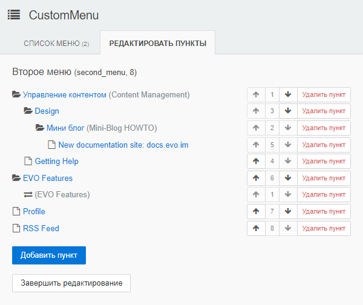
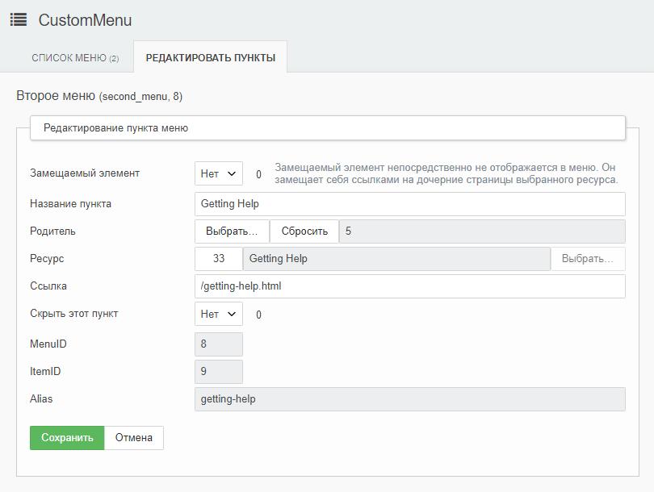

# CustomMenu

Модуль для создания кастомных менюшек в EvolutionCMS (Modx), не привязанных к дереву ресурсов.

Обязательная зависимость — класс DLTemplate (устанавливается c DocLister)





## Установка в EvolutionCMS

Модуль не имеет инсталлятора.

Для установки нужно

* вручную скопировать файлы модуля.  
* создать в админке модуль CustomMenu и указать в его содержимом:
    ```php
    include_once MODX_BASE_PATH.'assets/modules/CustomMenu/index.php';
    ```
* создать в админке сниппет CM и указать в его содержимом
    ```php
    <?php
    return include MODX_BASE_PATH.'assets/modules/CustomMenu/CM.snippet.php';
    ```

## Использование 

Вызов сниппета (выбор меню можно указать по его идентификатору или имени, имя имеет больший приоритет, если указаны оба параметра):

```
[[CM?
&menuId=`8`
&menuName=`mainmenu`
&tplWrap=`@CODE: <ul>[+wrap+]</ul>`
&tplItem=`@CODE: <li><a href="[+url+]">[+title+]</a>[+wrap+]</li>`
]]
```

## Разработка

Для пересборки модуля запустите webpack в корне модуля

```
webpack
```

При необходимости установите из npm зависимости

* @babel/core
* @babel/plugin-transform-runtime
* @babel/plugin-transform-spread
* @babel/preset-env
* babel-loader
* css-loader
* mini-css-extract-plugin
* node-sass
* sass-loader
* style-loader
* uglifyjs-webpack-plugin
* vue-loader
* vue-template-compiler
* webpack
